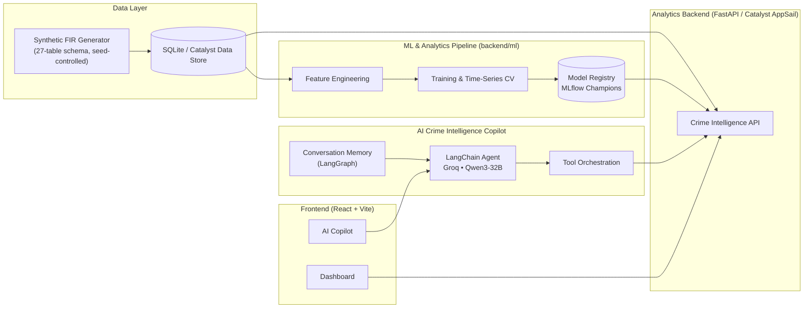

<div align="center">

# 🛡️ Astra — Agentic AI Crime Analytics & Intelligence Platform

**Turning the Karnataka State Police FIR database into an AI-powered crime intelligence platform featuring geospatial hotspot detection, criminal-network analysis, predictive analytics, and an Agentic AI copilot — deployed 100% on Zoho Catalyst.**


*Hack2skill Datathon 2026 · Karnataka State Police / State Crime Records Bureau (SCRB)*

</div>

---

## The Problem

KSP maintains extensive crime records, but the analytical ecosystem is held back by **data
silos and Excel-based reporting**, an **absence of AI-driven analytics**, **fragmented
information** reaching SCRB, and **reactive rather than proactive** policing. Astra replaces
static sheets with dynamic spatial + relational + predictive intelligence, moving SCRB toward
a **strategic intelligence hub**.

## Key Capabilities

| | Capability | What it does |
|---|---|---|
| 🗺️ | **Geospatial Command Center** | District → police-station drill-down, spatiotemporal **DBSCAN** hotspots, **red-zone** alerts when a crime category spikes vs. its historical baseline (z-score) |
| 🕸️ | **Link & Network Analysis** | Co-offending graph, repeat-offender profiles across jurisdictions, **Louvain** community detection to surface organised networks & recurring MO |
| 🧠 | **Predictive Intelligence** | Trained **crime-forecasting** models (next-week high-risk districts + volume) with proper time-series validation; socio-economic overlays |
| 🚨 | **Anomaly Radar** | **Isolation Forest** flags cases deviating from behavioural norms for investigators to link |
| 🤖 | AI Crime Intelligence Copilot | Agentic AI assistant powered by LangChain + Qwen3-32B that answers natural-language questions by orchestrating live analytics APIs, predictive models, hotspot detection, offender network analysis, and NLP classification. |
| 📝 | NLP Crime-Text AI | Champion NLP model for FIR narrative classification (18-model benchmark), accessible directly through the AI Copilot or dashboard interface. |
| 📈 | **Trend & Pattern Discovery** | Temporal decomposition, seasonality, emerging-typology alerts |

## Dashboard

A dark command-center SPA featuring Overview, Geospatial Intelligence, Link Analysis,
Predictive AI, NLP Text AI, and an integrated AI Crime Intelligence Copilot.

The copilot enables analysts to query the platform conversationally
(e.g. "Which districts are predicted high-risk next week?" or
"Show repeat offenders connected to X") while automatically orchestrating
multiple analytics services before generating a grounded response.

---

## 🤖 AI Crime Intelligence Copilot

Astra includes an Agentic AI assistant that enables analysts to
interact with the platform using natural language.

Unlike conventional chatbots, the assistant never answers analytical
questions from the language model's internal knowledge.

Instead it:

• Understands the user's intent.

• Chooses the required analytics tools.

• Executes backend API calls.

• Combines multiple tool outputs.

• Produces grounded responses.

Supported capabilities include:

- Crime statistics

- Trend analysis

- District comparison

- Crime hotspots

- Repeat offenders

- Criminal networks

- Predictive district risk

- FIR narrative classification


## Architecture


## Tech Stack — 100% Catalyst-native

Deployment on **Zoho Catalyst is mandatory** for this datathon; every capability maps to its
Catalyst service.

| Layer | Choice | Catalyst service |
|---|---|---|
| Frontend SPA | React + Vite + TS, Tailwind | Web Client Hosting |
| Maps · charts · graph | MapLibre GL · Recharts · Cytoscape | — |
| Analytics / ML | Python (FastAPI) | AppSail |
| Relational DB | FIR schema (27 tables) | Data Store |
| AI Copilot | LangChain + LangGraph + Groq (Qwen3-32B) | AppSail |
| Predictive Analytics | Scikit-learn + XGBoost + MLflow | AppSail |
| NLP Classification | Champion NLP model (18-model benchmark) | AppSail |
| Auth (RBAC) · Cache · Storage | | Authentication · Cache · Stratus |
| Scheduled retraining · alerts | | Cron · Signals · Mail/Push |
| CI/CD | | Pipelines |

---

## ML & MLOps

Not one-shot fitting — a real pipeline (`backend/ml/`): **data validation → feature
engineering → multi-family model selection via time-series CV → hold-out evaluation →
versioned model registry with champion/challenger → MLflow tracking → auto model cards →
scheduled retraining** (`cli.py train`, mapping to Catalyst Cron).

### Agentic AI Layer

Astra includes an Agentic AI assistant built using LangChain and Groq-hosted Qwen3-32B.

Unlike conventional chatbots, the assistant never answers analytical
questions from the language model's internal knowledge.

Instead, it automatically selects and invokes backend analytics tools
(KPIs, hotspot detection, predictive risk, offender networks, trend
analysis, and FIR classification), combines their outputs, and generates
grounded responses for police analysts.

The AI Crime Intelligence Copilot grounds every factual response through
backend analytics tools rather than relying solely on the language model's
internal knowledge, reducing hallucinated statistics while preserving
human oversight.

Every model is **benchmarked against a naive baseline** (last-week persistence / majority class)
so reported skill is honest, not inflated.

| Task | Models compared | Champion result (vs baseline) |
|---|---|---|
| High-risk district (next week) | LogReg · RF · HistGBM · GBM · XGBoost-GPU | **ROC-AUC 0.70** — strong ranking, but ≈ naive persistence at the operating point (district risk is highly persistent) |
| Next-week FIR volume | Ridge · RF · HistGBM · GBM · XGBoost-GPU | **R² 0.65** · **MAE 2.50 vs 2.63 persistence** (~5% lower) |
| Crime-text classification | **18 classifiers** incl. MLP neural-net + XGBoost-GPU | **Accuracy ≈ 0.86 · macro-F1 ≈ 0.87** |
| Anomaly detection | Isolation Forest, scored vs **160 planted ground-truth anomalies** | **ROC-AUC 0.98** · recall@1% **0.66** · precision@k **0.52** |

GPU: XGBoost auto-uses CUDA when an NVIDIA GPU is present (falls back to CPU). Time-series CV is
strictly forward-in-time; the anomaly detector is evaluated with real precision/recall against
labelled planted anomalies (not just a flag rate).

📊 **Full per-model performance** (all 5 tabular families + all 18 NLP models, with per-class
F1) is in **[docs/RESULTS.md](docs/RESULTS.md)**.

## Data & Fidelity

Real FIR microdata is confidential, so Astra runs on a **schema-faithful synthetic dataset**
(privacy-by-construction) seeded with real Karnataka ground truth (31 districts + geo,
IPC/NDPS acts & sections, NCRB taxonomy). A **fidelity suite** (`backend/analysis/`) validates
it against **real published statistics** (NCRB Crime-in-India 2022, Census 2011):

| Check | Result | Type | |
|---|---|---|---|
| District crime ↔ Census-2011 population | Spearman **0.78** | calibrated | ✅ |
| Women-crime composition vs NCRB-2022 | TVD **0.02** | calibrated | ✅ |
| Women chargesheeting vs 82.8% | Δ **0.03** | design choice | ✅ |
| Weekly momentum autocorrelation | **0.65** | planted (AR(1)) | ✅ |
| Co-offending network modularity | Q **0.60** | planted (gangs) | ✅ |
| Offender concentration (Gini) | **0.49** | **emergent** | ⚠️ diverges — honestly reported |

> **Read this before citing a number.** The first five rows are properties **calibrated or
> planted into the generator** — agreement confirms the generator/pipeline recovers what was
> built in, it is **not** an independent discovery about reality (the Census correlation *is*
> against real independent population figures, but the district weights were tuned to track
> population, so it is a calibration check). Only **offender-concentration Gini is genuinely
> emergent** — and it is the one metric that diverges from the real-world range, which is the
> honest result we foreground.

See [`backend/analysis/FIDELITY_REPORT.md`](backend/analysis/FIDELITY_REPORT.md) and
[`docs/PAPER_OUTLINE.md`](docs/PAPER_OUTLINE.md).

---

## Documentation

| Doc | What's in it |
|---|---|
| 📘 **[docs/DOCUMENTATION.md](docs/DOCUMENTATION.md)** | Full technical reference — architecture, data schema, ML/NLP pipelines, API, frontend, deployment |
| ⚙️ **[docs/SETUP.md](docs/SETUP.md)** | Setup & reproduction guide (deps → dataset → training → run) |
| 📊 **[docs/RESULTS.md](docs/RESULTS.md)** | Every model's performance (all families + 18 NLP models) |
| 🔬 **[backend/analysis/FIDELITY_REPORT.md](backend/analysis/FIDELITY_REPORT.md)** | Synthetic-vs-real data fidelity |
| 📄 **[docs/PAPER_OUTLINE.md](docs/PAPER_OUTLINE.md)** | Publishable write-up (honest framing + ethics) |

## Quick Start

Full reproduction steps (deps, dataset, training, running) are in **[docs/SETUP.md](docs/SETUP.md)**.

```bash
python -m pip install -r requirements.txt
python data/generator/generate.py --cases 40000 --seed 42   # generate dataset
python data/build_sqlite.py                                  # build DB
cd backend/ml && python cli.py train-all && cd ../..         # train all models
cd backend/appsail_ml && python -m uvicorn app:app --port 8000   # API  (terminal A)
cd frontend && npm install && npm run dev                        # dashboard (terminal B)
```

> The dataset and trained-model binaries are **git-ignored** (generated). The commands above
> regenerate them deterministically (`--seed 42`).

## Testing & CI

Quality gate so broken code can't land:
- **GitHub Actions** (`.github/workflows/ci.yml`) — on every push/PR: Python **lint (ruff)** +
  **pytest**, and frontend **type-check + build**.
- **pytest suite** (`backend/tests/`) — generator, SQLite, analytics, features, NLP, and API
  smoke tests, run against a freshly generated small dataset.
- **pre-commit hooks** (`.pre-commit-config.yaml`) — lint, secret detection, and a large-file
  guard at commit-time; the full test suite runs at push-time.

```bash
pip install -r requirements-dev.txt
pytest backend/tests -q            # run the tests
ruff check backend data            # lint
pre-commit install && pre-commit install --hook-type pre-push   # enable local hooks
```

## Project Structure

```
data/
  generator/        reference.py (real KA ground truth) + generate.py
  build_sqlite.py   CSV -> queryable SQLite (mirrors Data Store)
backend/
  ml/               MLOps pipeline: features, models, CV, registry, MLflow, cli
  appsail_ml/       FastAPI analytics service (hotspots, network, forecast, NLP, anomaly)
  analysis/         fidelity evaluation vs real published statistics
  tests/            pytest suite (generator, sqlite, analytics, features, nlp, api)
chatbot/
frontend/           React + Vite + Tailwind dashboard (5 pages)
.github/workflows/  CI (lint + tests + frontend build)
docs/               DOCUMENTATION.md · SETUP.md · RESULTS.md · PAPER_OUTLINE.md
```

## Responsible Use

Predictive policing carries real risks (bias, feedback loops, over-policing). Astra is built
as **decision-support, not automated enforcement**: synthetic-only data (no surveillance of
real people), transparent model cards & open metrics, human-in-the-loop framing, and an
explicit non-goal of individual-level predictive policing. See the ethics section of
[`docs/PAPER_OUTLINE.md`](docs/PAPER_OUTLINE.md).

## Roadmap

- [ ] Catalyst deployment config + CI/CD (Pipelines) + Auth (RBAC) + Cron/Signals alerts
- [ ] Learned generative model (SDV/CTGAN) on a real seed, re-validated by the fidelity suite
- [ ] **Fuzzy entity resolution** (noisy-name generator mode + rapidfuzz/Jaro-Winkler with
      reported precision/recall) — today link analysis assumes exact-match offender identity,
      which real FIR data (spelling/transliteration variants, no shared person ID) will not have

---

