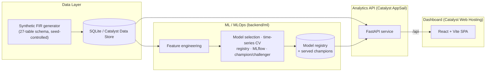

<div align="center">

# 🛡️ Astra — AI-Driven Crime Analytics & Intelligence Platform

**Turning the Karnataka State Police FIR database into geospatial hotspot intelligence,
criminal-network link analysis, and AI-driven predictive dashboards — deployed 100% on Zoho Catalyst.**


*Hack2skill Datathon 2026 · Karnataka State Police / State Crime Records Bureau (SCRB)*

</div>

---

## The Problem

KSP maintains extensive crime records, but the analytical ecosystem is held back by **data
silos and Excel-based reporting**, an **absence of AI-driven analytics**, **fragmented
information** reaching SCRB, and **reactive rather than proactive** policing. Astra replaces
static sheets with dynamic spatial + relational + predictive intelligence, moving SCRB toward
a **strategic intelligence hub**.

## Key Capabilities

| | Capability | What it does |
|---|---|---|
| 🗺️ | **Geospatial Command Center** | District → police-station drill-down, spatiotemporal **DBSCAN** hotspots, **red-zone** alerts when a crime category spikes vs. its historical baseline (z-score) |
| 🕸️ | **Link & Network Analysis** | Co-offending graph, repeat-offender profiles across jurisdictions, **Louvain** community detection to surface organised networks & recurring MO |
| 🧠 | **Predictive Intelligence** | Trained **crime-forecasting** models (next-week high-risk districts + volume) with proper time-series validation; socio-economic overlays |
| 🚨 | **Anomaly Radar** | **Isolation Forest** flags cases deviating from behavioural norms for investigators to link |
| 📝 | **NLP Crime-Text AI** | Classify crime type from the free-text FIR narrative (**18-model bake-off**), entity extraction, modus-operandi clustering |
| 📈 | **Trend & Pattern Discovery** | Temporal decomposition, seasonality, emerging-typology alerts |

## Dashboard

A dark "command-center" SPA with five views — **Overview** (KPIs + red-zone alerts),
**Geospatial** (MapLibre map), **Link Analysis** (Cytoscape graphs), **Predictive AI**
(risk landscape + model card), and **NLP Text AI** (live classifier + model leaderboard).

---

## Architecture



## Tech Stack — 100% Catalyst-native

Deployment on **Zoho Catalyst is mandatory** for this datathon; every capability maps to its
Catalyst service.

| Layer | Choice | Catalyst service |
|---|---|---|
| Frontend SPA | React + Vite + TS, Tailwind | Web Client Hosting |
| Maps · charts · graph | MapLibre GL · Recharts · Cytoscape | — |
| API / backend | Node serverless | Serverless Functions + API Gateway |
| Analytics / ML | Python (FastAPI) | AppSail |
| Relational DB | FIR schema (27 tables) | Data Store |
| Predictive risk | tabular forecasting | Zia AutoML |
| NLP / RAG | crime-text + copilot | QuickML · Zia Text Analytics |
| Auth (RBAC) · Cache · Storage | | Authentication · Cache · Stratus |
| Scheduled retraining · alerts | | Cron · Signals · Mail/Push |
| CI/CD | | Pipelines |

---

## ML & MLOps

Not one-shot fitting — a real pipeline (`backend/ml/`): **data validation → feature
engineering → multi-family model selection via time-series CV → hold-out evaluation →
versioned model registry with champion/challenger → MLflow tracking → auto model cards →
scheduled retraining** (`cli.py train`, mapping to Catalyst Cron).

| Task | Models compared | Champion result |
|---|---|---|
| High-risk district (next week) | LogReg · RF · HistGBM · GBM · XGBoost-GPU | **ROC-AUC ≈ 0.70** |
| Next-week FIR volume | Ridge · RF · HistGBM · GBM · XGBoost-GPU | **R² ≈ 0.64** (beats naive baseline) |
| Crime-text classification | **18 classifiers** incl. MLP neural-net + XGBoost-GPU | **Accuracy ≈ 0.86 · macro-F1 ≈ 0.87** |
| Anomaly detection | Isolation Forest | 1% flagged |

GPU: XGBoost auto-uses CUDA when an NVIDIA GPU is present (falls back to CPU).

📊 **Full per-model performance** (all 5 tabular families + all 18 NLP models, with per-class
F1) is in **[docs/RESULTS.md](docs/RESULTS.md)**.

## Data & Fidelity

Real FIR microdata is confidential, so Astra runs on a **schema-faithful synthetic dataset**
(privacy-by-construction) seeded with real Karnataka ground truth (31 districts + geo,
IPC/NDPS acts & sections, NCRB taxonomy). A **fidelity suite** (`backend/analysis/`) validates
it against **real published statistics** (NCRB Crime-in-India 2022, Census 2011):

| Check | Result | |
|---|---|---|
| District crime ↔ Census population | Spearman **0.78** | ✅ |
| Women-crime composition vs NCRB | TVD **0.009** | ✅ |
| Women chargesheeting vs 82.8% | Δ **0.02** | ✅ |
| Weekly momentum autocorrelation | **0.64** | ✅ |
| Co-offending network modularity | Q **0.63** | ✅ |
| Offender concentration (Gini) | **0.50** | ⚠️ honestly reported |

See [`backend/analysis/FIDELITY_REPORT.md`](backend/analysis/FIDELITY_REPORT.md) and
[`docs/PAPER_OUTLINE.md`](docs/PAPER_OUTLINE.md).

---

## Documentation

| Doc | What's in it |
|---|---|
| 📘 **[docs/DOCUMENTATION.md](docs/DOCUMENTATION.md)** | Full technical reference — architecture, data schema, ML/NLP pipelines, API, frontend, deployment |
| ⚙️ **[docs/SETUP.md](docs/SETUP.md)** | Setup & reproduction guide (deps → dataset → training → run) |
| 📊 **[docs/RESULTS.md](docs/RESULTS.md)** | Every model's performance (all families + 18 NLP models) |
| 🔬 **[backend/analysis/FIDELITY_REPORT.md](backend/analysis/FIDELITY_REPORT.md)** | Synthetic-vs-real data fidelity |
| 📄 **[docs/PAPER_OUTLINE.md](docs/PAPER_OUTLINE.md)** | Publishable write-up (honest framing + ethics) |

## Quick Start

Full reproduction steps (deps, dataset, training, running) are in **[docs/SETUP.md](docs/SETUP.md)**.

```bash
python -m pip install -r requirements.txt
python data/generator/generate.py --cases 40000 --seed 42   # generate dataset
python data/build_sqlite.py                                  # build DB
cd backend/ml && python cli.py train-all && cd ../..         # train all models
cd backend/appsail_ml && python -m uvicorn app:app --port 8000   # API  (terminal A)
cd frontend && npm install && npm run dev                        # dashboard (terminal B)
```

> The dataset and trained-model binaries are **git-ignored** (generated). The commands above
> regenerate them deterministically (`--seed 42`).

## Project Structure

```
data/
  generator/        reference.py (real KA ground truth) + generate.py
  build_sqlite.py   CSV -> queryable SQLite (mirrors Data Store)
backend/
  ml/               MLOps pipeline: features, models, CV, registry, MLflow, cli
  appsail_ml/       FastAPI analytics service (hotspots, network, forecast, NLP, anomaly)
  analysis/         fidelity evaluation vs real published statistics
frontend/           React + Vite + Tailwind dashboard (5 pages)
docs/               DOCUMENTATION.md · SETUP.md · RESULTS.md · PAPER_OUTLINE.md
```

## Responsible Use

Predictive policing carries real risks (bias, feedback loops, over-policing). Astra is built
as **decision-support, not automated enforcement**: synthetic-only data (no surveillance of
real people), transparent model cards & open metrics, human-in-the-loop framing, and an
explicit non-goal of individual-level predictive policing. See the ethics section of
[`docs/PAPER_OUTLINE.md`](docs/PAPER_OUTLINE.md).

## Roadmap

- [ ] AI copilot (QuickML LLM serving + RAG over IPC & case facts) + PDF reports (SmartBrowz)
- [ ] Catalyst deployment config + CI/CD (Pipelines) + Auth (RBAC) + Cron/Signals alerts
- [ ] Learned generative model (SDV/CTGAN) on a real seed, re-validated by the fidelity suite

---

